### Deep Learning on Multimodal Sensor Data at the Wireless Edge for Vehicular Network

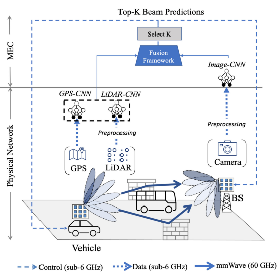

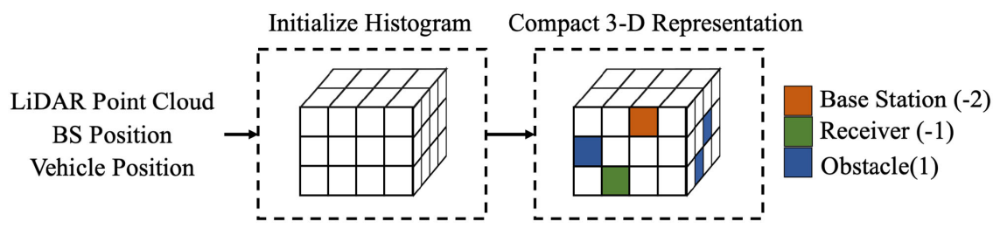

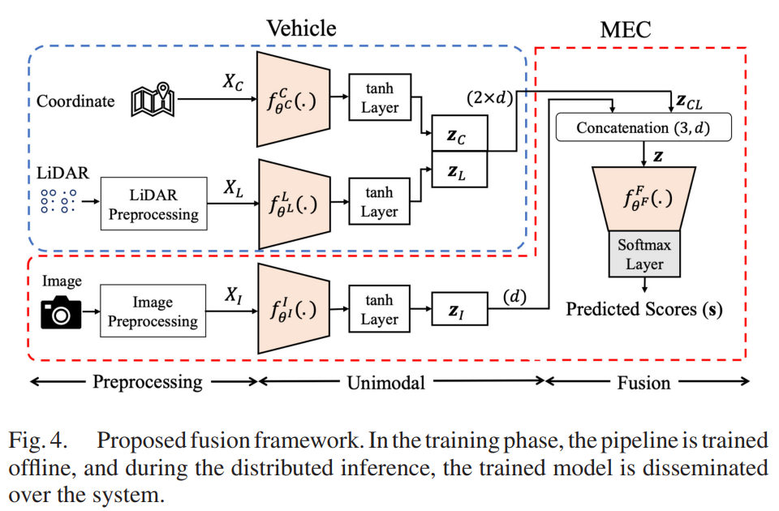

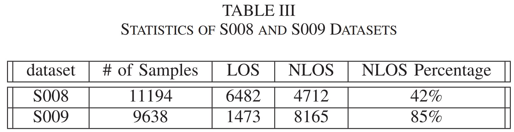

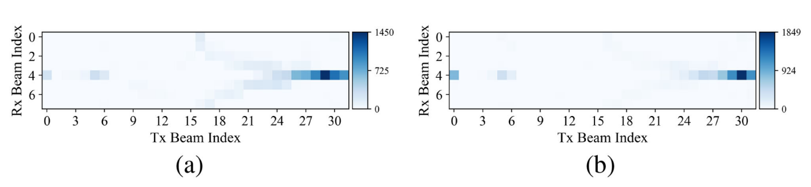

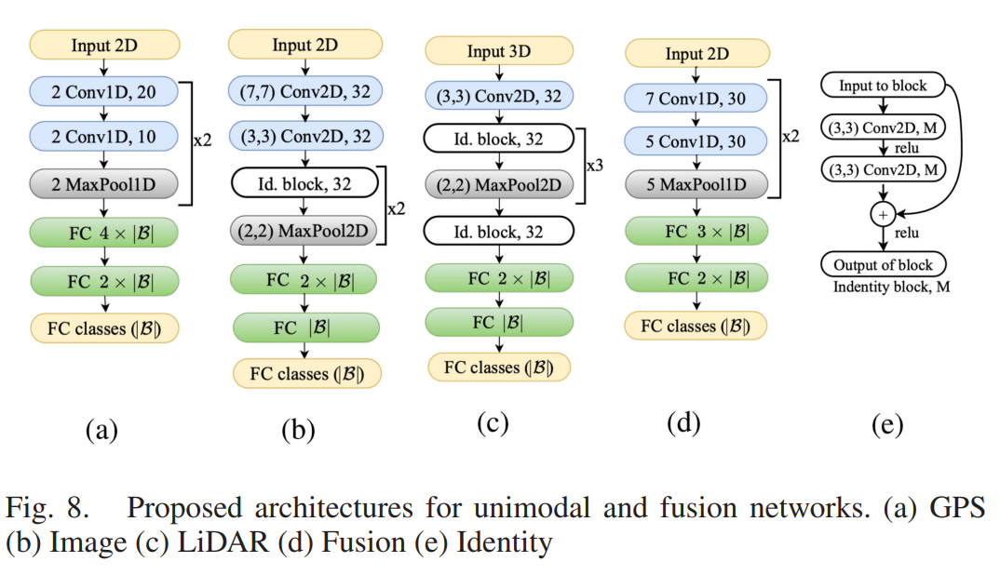

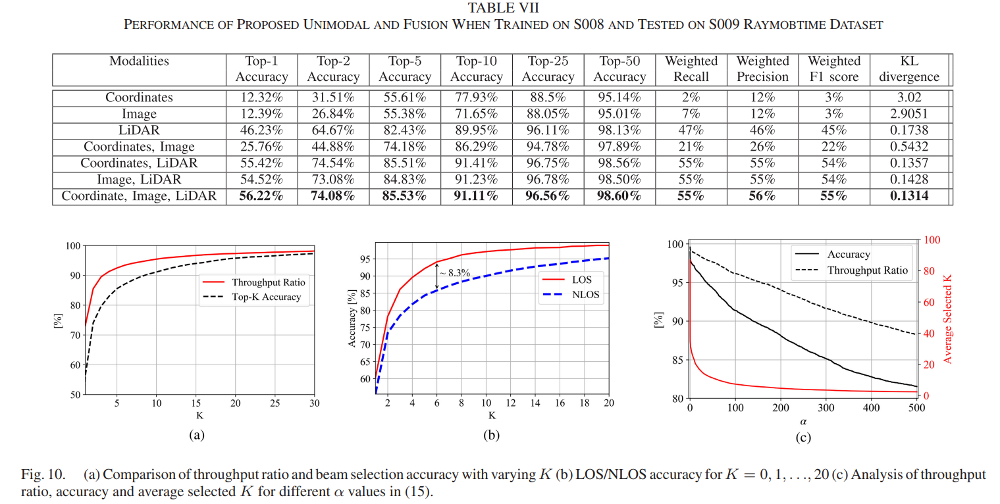

https://github.com/wesleylp/TVT_beam_selection

### Work from Joanna

[TVT Beam Selection GitHub Repository](https://github.com/batoolsalehi/TVT_beam_selection)

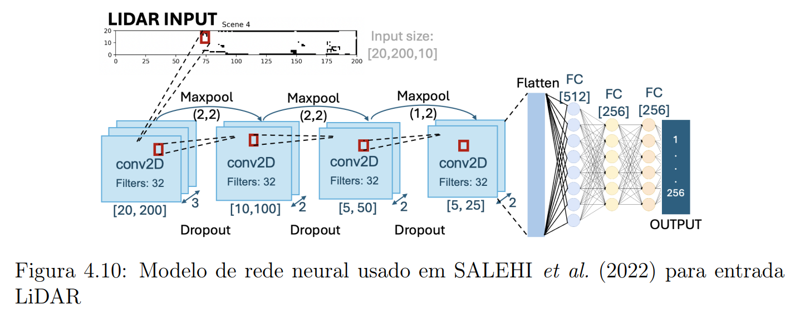

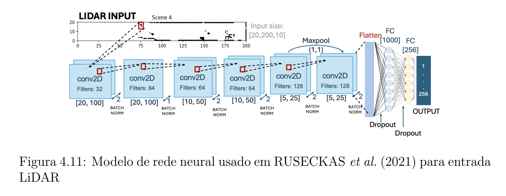

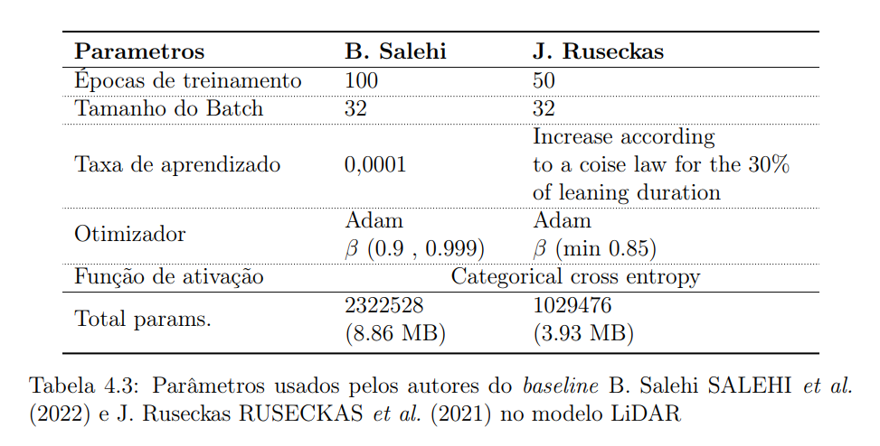

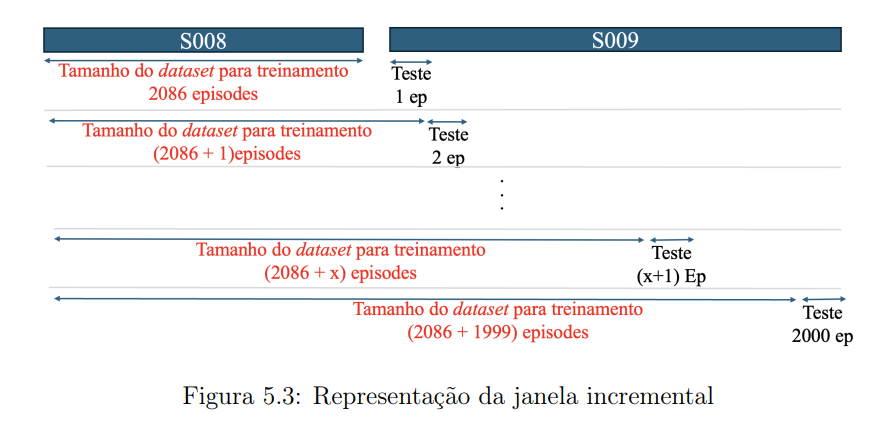

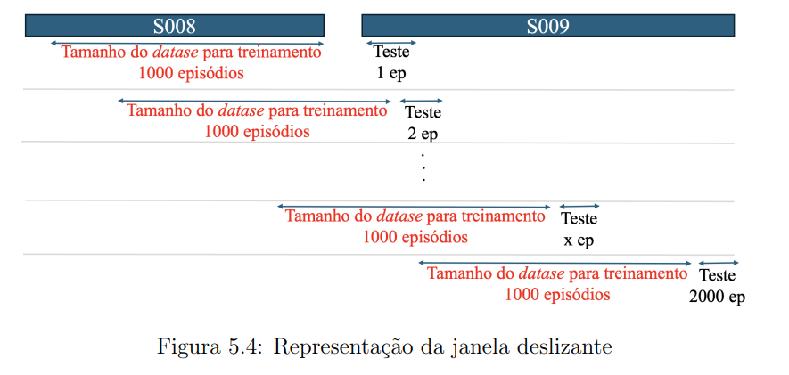

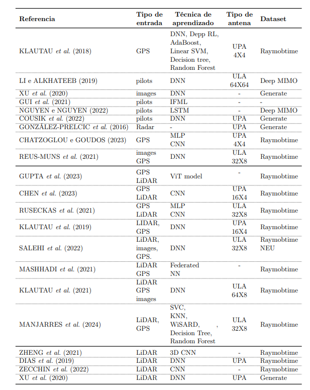