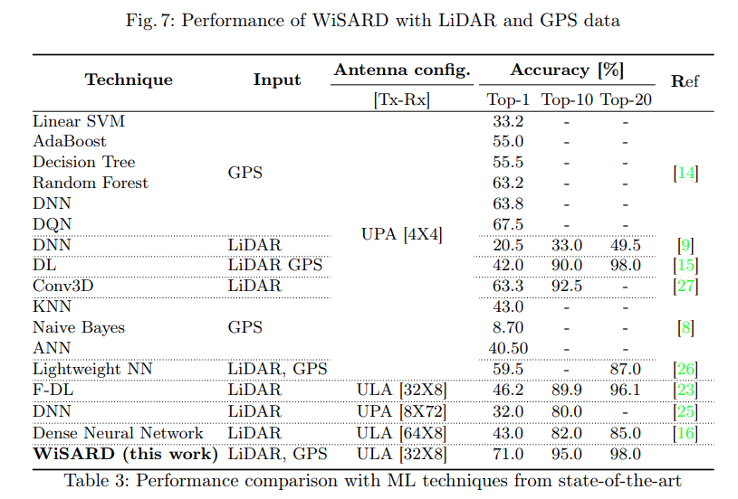
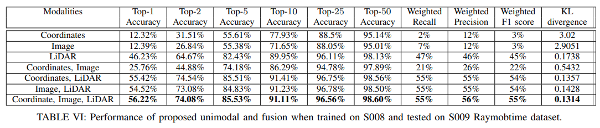
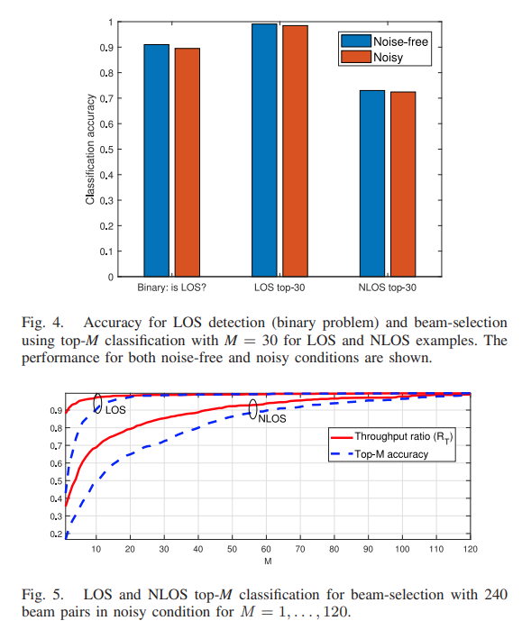
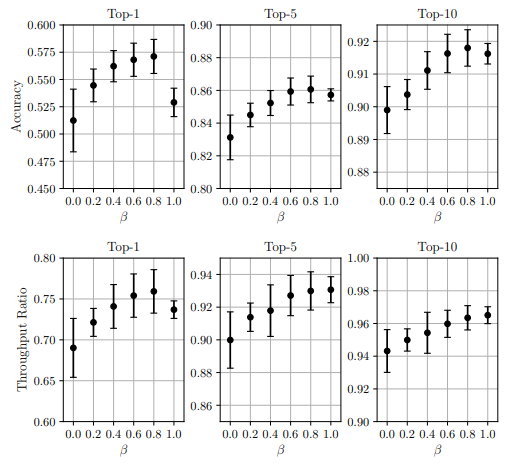
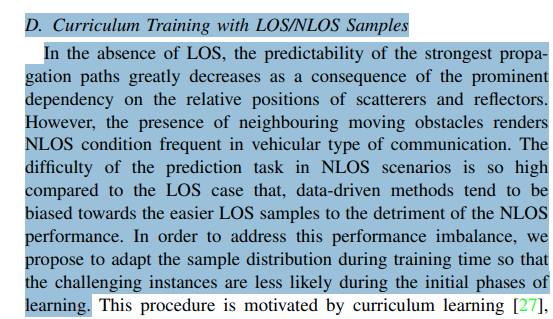

# 01 - A WiSARD Network Approach for 5G MIMO Beam Selection

* They **used Raymobtime S008 only**.
* They report **20,860 samples**, with **11,194 “valid” samples** used for experiments, split into **80% training and 20% testing** .
* They **do not report a separate validation set**. The only explicit split is train vs test .

Accuracy is **top-k classification accuracy** for predicting the best beam-pair index. The paper reports results for three input cases, **LiDAR-only**, **GPS-only**, and **GPS+LiDAR**. 

| Case            |     Top-1 |    Top-10 |    Top-20 |
| --------------- | --------: | --------: | --------: |
| **LiDAR only**  |    ≈0.620 |    ≈0.950 |    ≈0.970 |
| **GPS only**    |    ≈0.690 |    ≈0.955 |    ≈0.980 |
| **GPS + LiDAR** | **0.710** | **0.950** | **0.980** |

The accuracies reported in this paper (Figures 4b, 6b, 7b and the “WiSARD (this work)” row in Table 3) are for the full evaluation set, not separated by propagation condition. The dataset they use (Raymobtime S008) contains both LOS and NLOS, and includes an LOS/NLOS indicator in the metadata 

# 02 - Deep Learning on Multimodal Sensor Data at the Wireless Edge for Vehicular Network [COMPARABLE]

* They used **both** Raymobtime subsets **S008 and S009**. 
* **Meaning of the subsets**: **S008 = regular traffic**, **S009 = rush-hour traffic**. 
* **Train/validation/test split**:
  * **S008 was used for training and validation**.
  * **S009 was used as the testing set**. 
* **Validation details**: they tuned hyperparameters using a **held-out validation split**, holding out **17% of the training data for Raymobtime**. 
  This implies S008 was internally split into train and validation, then final evaluation was on S009. 

* **S008**: 11,194 samples, 6,482 LOS, 4,712 NLOS (42% NLOS). 
* **S009**: 9,638 samples, 1,473 LOS, 8,165 NLOS (85% NLOS). 

| Modalities                  |      Top-1 |  Top-2 |      Top-5 |     Top-10 | Top-25 |     Top-50 |
| --------------------------- | ---------: | -----: | ---------: | ---------: | -----: | ---------: |
| Coordinates                 |     12.32% | 31.51% |     55.61% |     77.93% | 88.50% |     95.14% |
| Image                       |     12.39% | 26.84% |     55.38% |     71.65% | 88.05% |     95.01% |
| LiDAR                       |     46.23% | 64.67% |     82.43% |     89.95% | 96.11% |     98.13% |
| Coordinates + Image         |     25.76% | 44.88% |     74.18% |     86.29% | 94.78% |     97.89% |
| Coordinates + LiDAR         |     55.42% | 74.54% |     85.51% | **91.41%** | 96.75% |     98.56% |
| Image + LiDAR               |     54.52% | 73.08% |     84.83% |     91.23% | 96.78% |     98.50% |
| Coordinates + Image + LiDAR | **56.22%** | 74.08% | **85.53%** |     91.11% | 96.56% | **98.60%** |

# 03 - MIMO Beam Selection in 5G Using Neural Networks

they report using s008 for training and for validation to measure solution accuracy.
they trained for 50 epochs and saved weights based on top-5 accuracy computed on “validation data in s008”, which implies they also did an internal split inside s008 (train vs validation) for model selection. 
After training, they explicitly say they tested the model on s009, and present analysis on s009 (F1 vs pair index, confusion matrix, and accuracy vs position).

s008: used for training 

s009: described as validation “to measure our solutions accuracy” 
They also mention a separate challenge scoring on s010 (unlabeled)

There is inconsistent wording in the paper:

They explicitly claim: train on s008, validate on s009 
But in the training section they report validation accuracy on s008, then say they tested on s009
On s009 they show per-class F1, confusion matrix, and top-5 accuracy vs position, but they do not give a single overall top-1 number for s009 in the text shown.

| Case (model input) | Dataset split explicitly reported | Top-1 accuracy | Top-5 accuracy | Notes                                                                        |
| ------------------ | --------------------------------: | -------------: | -------------: | ---------------------------------------------------------------------------- |
| **GNSS + LiDAR**   |   Validation, Raymobtime **s008** |       **0.68** |       **0.94** | Reported as the obtained top-1 and top-5 accuracies on the validation data.  |
| **GNSS only**      |   Validation, Raymobtime **s008** |       **0.64** |       **0.91** | Reported for the model variant that uses only GNSS coordinates as input.     |

Additional statement tied to the **GNSS-only** case: they interpret top-5 as “probability to find the best beam among top-5 beams”, and state it is **91%** when only GNSS is used. 

On s009 (their test analysis):

They do not give a single aggregate top-1/top-5 number for all of s009 in text.
They do state that, along the vehicle trajectory, in 75% of the time the accuracy exceeds 85% (from the top-5 accuracy vs position plot discussion). 
MIMO Beam Selection in 5G Using…
They also show F1 varying by beam-pair (roughly 0.1 to 0.75 across pairs), indicating uneven per-class performance on s009.

# 04 - LIDAR Data for Deep Learning-Based mmWave Beam-Selection

This paper does not mention Raymobtime, S008, or S009 anywhere. Nor the raymobtime. It does mention data for 5G MIMO (Aldebaro paper): 5G MIMO Data for Machine Learning: Application to Beam-Selection using Deep Learning

A paired simulation dataset built by integrating SUMO (traffic), BlenSor (LIDAR), and Remcom Wireless InSite (ray tracing), in a Rosslyn, Virginia “urban canyon” scenario. That is, they use the raymobtime, but it is not explicitly mentioned what version it is.

* They generated **NL = 6,482 LOS** channel examples and **NN = 4,712 NLOS** channel examples. 
* They explicitly **separate LOS and NLOS evaluations** for beam selection to avoid mixing effects. 
* **Train/test split**: “disjoint test and training sets with **20% test** and **80% training**” for all experiments. 
* LOS detection (binary classification) uses **all (NL + NN)** examples, beam selection experiments use LOS-only or NLOS-only subsets depending on the evaluation. 

Values below are read from **Fig. 4** (top, page 4), which reports accuracy for **LOS detection** and **top-M beam selection with M = 30** under **noise-free** and **noisy** positioning conditions. 

| Case (Fig. 4)                                    | Noise-free accuracy | Noisy accuracy |
| ------------------------------------------------ | ------------------: | -------------: |
| **Binary LOS detection** (“Binary: is LOS?”)     |           **0.909** |      **0.894** |
| **Beam selection, LOS, top-30** (“LOS top-30”)   |           **0.990** |      **0.983** |
| **Beam selection, NLOS, top-30** (“NLOS top-30”) |           **0.728** |      **0.723** |

The authors also explicitly report, for **LOS detection in the noise-free condition**, a **geometry-based stump** baseline with **24% misclassification error** and the **DL model with 10% misclassification error**. 

# 05 - LIDAR and Position-Aided mmWave Beam Selection with Non-local CNNs and Curriculum Training [COMPARABLE]

They used **both subsets**, with a **fixed split by subset**:

* **S008**: used to **train all models**. 
* **S009**: used for **testing** (final evaluation). 

Their main results are reported as **top-k accuracy A(k)** (beam index in top-k predictions) and also **throughput ratio T(k)**. 
A(k) is the fraction of samples where the true best beam (or best beam pair) is contained in the model’s k highest-scoring predictions.
T(k) measures how much throughput you achieve if, instead of exhaustively searching all beams, you only try the model’s top-k candidate beams and then pick the best among those k.

A(k) is a hit-rate metric. It only cares whether the optimal beam is in the list, not how close the “misses” are.
T(k) is a quality-of-service metric. Even if you miss the exact optimal beam, you may still get nearly optimal throughput if your shortlist contains a near-optimal beam.

The headline results for the **proposed model** (Table III) are:

* **Top-1 accuracy**: **59.5% ± 0.5%**
* **Top-5 accuracy**: **87.0% ± 0.3%**
* **Top-10 accuracy**: **92.2% ± 0.2%** 

If you also want the paired throughput ratios from the same table (often more relevant than raw accuracy in this task):

* **Top-1 throughput ratio**: **79.9% ± 0.8%**
* **Top-5 throughput ratio**: **94.6% ± 0.8%**
* **Top-10 throughput ratio**: **96.9% ± 0.6%** 

# 06 - A Deep Learning-Based mmWave Beam Selection Framework by Using LiDAR Data

They state they use the Raymobtime open dataset and the Rosslyn city urban scenario.
They do not mention S008 or S009 anywhere, and they do not describe a protocol like “train on S008, validate on S009”. The dataset section only describes Raymobtime in general and says they use “LiDAR and beam data” for beam selection.

They do not specify which Raymobtime subset, nor how they split train, validation, and test. The only explicit split-related statement is that they evaluate “testing data” at every epoch.

they do not state whether they trained on LOS only, NLOS only, or mixed LOS+NLOS, and they do not report separate LOS and NLOS results. (No partitioning statement, no per-condition tables.)

they do not specify the split rule (percentage, random seed strategy, whether frames are time-correlated, whether test is disjoint in time or vehicles), and they do not describe cross-scenario testing (like S008 → S009).

Why their 63.3% is not directly comparable to your 61%

They do not state cross-scenario generalization. Your protocol explicitly tests on a different scenario (S009) after training on S008, which is typically harder. They only say “Raymobtime open datasets” and show a single scenario figure (Rosslyn city), with no S00x identifiers.

Why their 63.3% is not directly comparable to your 61%

They do not state cross-scenario generalization. Your protocol explicitly tests on a different scenario (S009) after training on S008, which is typically harder. They only say “Raymobtime open datasets” and show a single scenario figure (Rosslyn city), with no S00x identifiers.

Table II reports “All accuracy (256)”, “Top-50 accuracy”, and “Top-10 accuracy” for the baseline and their two models. 

* **Conv2D-based**: All = **0.622**, Top-50 = **0.925**, Top-10 = **0.960** 
* **Conv3D-based**: All = **0.633**, Top-50 = **0.930**, Top-10 = **0.955** 

# 07 - Synaptic Intelligence-Based Beam Selection in Dynamic Environments

* They used **both** subsets. They explicitly state that **s008 and s009 are collected at different times on the same street**. 
* They **did not** use **s008 for training** and **s009 for validation**.
* Instead, they build a **continual learning** setup with **two sequential tasks**:
  * **Task A / dataset (D_A)**: derived from **s008**, treated as “regular traffic” and assumed **LOS-only** for simplicity. 
  * **Task B / dataset (D_B)**: derived from **s009**, treated as “rush-hour traffic” and assumed **NLOS-only** for simplicity. 
* They evaluate **top-k accuracy** on (D_A), on (D_B), and the **average across both** (their “acc(k)”). 

* (D_A) (from **s008**): **6000 train**, **955 validation**, **1000 test**. 
* (D_B) (from **s009**): **9000 train**, **1877 validation**, **2000 test**. 

* Two-stage training:

  * Stage 1: train on **Task A** then compute parameter importance.
  * Stage 2: train on **Task B** with their SI-based regularized loss. 
* Training config mentioned: **100 epochs per task**, batch size **64**. 
* Evaluation during training:

  * Epochs **1–100** (Task A training): test on **Test Set A** after each epoch.
  * Epochs **101–200** (Task B training): test on **both Test Set A and Test Set B** after each epoch. 

* They tune (\lambda) (regularization strength) and state **best performance at (\lambda = 1000)**. 
* The paper does **not** print these accuracies in a table. They are shown only in **Fig. 4**. Values below are **approximate readings from the plot**:

  * **Top-1 acc(k)** at (\lambda \approx 1000): **≈ 0.439**
  * **Top-2 acc(k)** at (\lambda \approx 1000): **≈ 0.642**
  * **Top-5 acc(k)** at (\lambda \approx 1000): **≈ 0.800**
  * **Top-10 acc(k)** at (\lambda \approx 1000): **≈ 0.889**
  * Baseline ((\lambda = 0), “no CL”) from dashed red line in Fig. 4: **Top-1 ≈ 0.430**, **Top-2 ≈ 0.605**, **Top-5 ≈ 0.772**, **Top-10 ≈ 0.856** (approx.). 

They highlight catastrophic forgetting in the baseline after switching tasks, and that SIBS retains higher accuracy on Task A after learning Task B. 
Again, **no table**, only curves. Approximate end-of-training values (around epoch 200) from Fig. 5:

**Test Set A (old task after learning new task, Fig. 5a):**

* Baseline: Top-1 **≈ 0.35**, Top-5 **≈ 0.75**
* SIBS: Top-1 **≈ 0.43**, Top-5 **≈ 0.83** (highest retention among shown methods)

**Test Set B (new task, Fig. 5b):**

* Baseline: Top-1 **≈ 0.50**, Top-5 **≈ 0.79**
* SIBS: Top-1 **≈ 0.44**, Top-5 **≈ 0.76** (slightly worse on new task, consistent with their text). 

# 08 - Machine Learning-Enabled Localization in 5G using LIDAR and RSS Data

They explicitly use Raymobtime-s008 and Raymobtime-s009.
They discard invalid channels, leaving 11,194 samples for s008 and 9,638 for s009 
Then they split the datasets into 60% training and 40% testing
So the usage is: s008 has its own train/test split, s009 has its own train/test split, and they report results for both DS1 and DS2.

This paper is primarily localization, not beam selection. Their main performance metrics are RMSE and MAE (meters). 

Table II reports classification accuracy for DS1 and DS2: 

Hybrid, solid boundaries: 97.12% (DS1), 98.14% (DS2)
Image-only, solid boundaries: 97.1% (DS1), 97.9% (DS2)
Hybrid, overlapping boundaries: 99.5% (DS1), 99.95% (DS2)
Image-only, overlapping boundaries: 98.12% (DS1), 98.8% (DS2)

This is a completelly different accuracy, not the top-k beam selection accuracy.

Table III reports localization RMSE and MAE by region and totals. Key totals: 

One CNN baseline
RMSE: 9.44 (DS1), 12.51 (DS2)
MAE: 10.91 (DS1), 9.82 (DS2) 

Best overall method they claim

Regional CNN with overlapping boundaries plus hybrid classification:
Total RMSE: 7.79 (DS1), 7.08 (DS2)
Total MAE: 7.41 (DS1), 6.55 (DS2)

# 09 - Federated mmWave Beam Selection Utilizing LIDAR Data

They used **both** datasets.

* **Training set:** **s008**. They explicitly state they “train the models on samples from dataset s008”. 
* **Test set:** **s009**. They explicitly state they “test on those from s009”. 
* I found **no statement** that s009 was used as a validation set. In their terminology and evaluation section, **s009 is used as the test dataset**.

Sample counts (as reported):

* **s008 (train):** 6482 LOS, 4712 NLOS. 
* **s009 (test):** 1473 LOS, 8165 NLOS. 

They also reuse **s008** for the federated-learning experiments by distributing s008 samples across vehicles’ local datasets. 

* **Top-10 accuracy:** **91.17%** (reported as top-10 classification accuracy on Raymobtime). 
* Table I (centralized comparison) reports **Top-10 accuracy = 91.17% ± 0.28%** for the proposed model, and **83.92% ± 0.93%** for the baseline [12],[13]. 

Breakdown by propagation condition (still evaluated on s009):

* **LOS Top-10 accuracy:** 94.50%
* **NLOS Top-10 accuracy:** 90.77% 

Final **Top-10 accuracy** on s009 depends on number of vehicles (V) and local epochs (N_v) (Table II). 

* **V=5:** 90.12% (Nv=1), 90.34% (Nv=2), 89.92% (Nv=5)
* **V=10:** 89.77% (Nv=1), 89.16% (Nv=2), 88.64% (Nv=5)
* **V=20:** 88.81% (Nv=1), 88.53% (Nv=2), 87.33% (Nv=5)

## 10 - Efficient Dynamic mmWave Beam Selection Using Multimodal Attention-Based Approach [COMPARABLE]

* **They used both subsets.**
* **S008 was used for training.** The paper explicitly states: “we use scenario S008 for training”. 
* **S009 was used for testing, not validation.** They state: “scenario S009 for testing”, motivated as evaluation on “unseen environmental conditions” to test generalization. 
* **Validation is mentioned but not tied to S009.** They say they use validation data for early stopping and monitoring during training, but they do not specify whether validation is a split from S008, a separate subset, or something else. 

Their main reported results for the proposed full multimodal attention model are:

* **Top-1 accuracy:** **59.77%** 
* **Top-5 accuracy:** **90.62%** 
* **Top-10 accuracy:** **96.2%** 
* **Top-50 accuracy:** **99.12%** 

They also restate Top-10 and Top-50 in the results section (256 classes). 

* Coordinate only: **Top-1 20.95%**, **Top-5 69.93%**, **Top-10 83.69%** 
* LiDAR only: **Top-1 54.7%**, **Top-5 87.76%**, **Top-10 92.23%** 
* Combined without attention: **Top-1 56.89%**, **Top-5 86.13%**, **Top-10 93.74%** 
* Full with attention: **Top-1 59.77%**, **Top-5 90.62%**, **Top-10 96.2%** 

## 11 - Efficient mmWave Beam Selection using ViTs and GVEC: GPS-based Virtual Environment Capture [COMPARABLE]

* **Training:** **s008** 
* **Testing:** **s009** 

**Dataset sizes (after their preprocessing):**

* s008 (train): **11,194** records
* s009 (test): **9,638** records 

They increase the **test dataset** by adding **25% (2400) additional records** with random LiDAR noise to mimic adverse weather. 
Then they propose **GVEC** to replace noisy LiDAR using GPS-derived “virtual environment” occupancy information. 

They report **Top-K Accuracy** for **T1, T5, T10** (Top-1, Top-5, Top-10) on:

1. the original test set, and
2. a “noisy dataset treated with GVEC”.

From **Table I**: 

Original dataset (s009 test)

* **Proposed ViT:** **T1 59.87%**, **T5 86.13%**, **T10 92.23%** 
* **CNN baseline:** **T1 59.16%**, **T5 87.01%**, **T10 92.13%** 

Noisy test dataset (s009-derived, then corrected using GVEC)

* **Proposed ViT:** **T1 59.35%**, **T5 85.83%**, **T10 92.19%** 
* **CNN baseline:** **T1 42.09%**, **T5 78.78%**, **T10 87.20%** 

# 12 - Deep Learning on Visual and Location Data for V2I mmWave Beamforming [COMPARABLE]

* The authors explicitly state they **evaluate** their approach using the **Raymobtime multimodal datasets s008 and s009**. 
* They use the **image** modality (camera images) and **coordinate** modality (2D receiver location) from Raymobtime. 
* They describe each scene as labeled with the **best beam-pair** among **256 combinations** (Tx=32, Rx=8). 

The paper **does not specify** any split rule like “train on s008, validate/test on s009”, nor does it describe how s008 and s009 are partitioned into train, validation, and test. It only reports “test accuracies” without stating whether the test set is s009-only, a mix of both, or a random split across both datasets. 

Table I reports the following **test** accuracies: 

| Modality    | Top-1 Acc | Top-2 Acc | Top-5 Acc | Top-10 Acc | Top-30 Acc | Top-50 Acc |
| ----------- | --------: | --------: | --------: | ---------: | ---------: | ---------: |
| Visual data |    16.70% |     31.8% |     58.2% |     78.46% |     91.88% |     95.68% |
| Coordinate  |    54.72% |     71.4% |       83% |     87.71% |     96.99% |     98.91% |
| Fusion      |    57.53% |    75.61% |    87.96% |  **93.4%** |     98.11% |     99.07% |